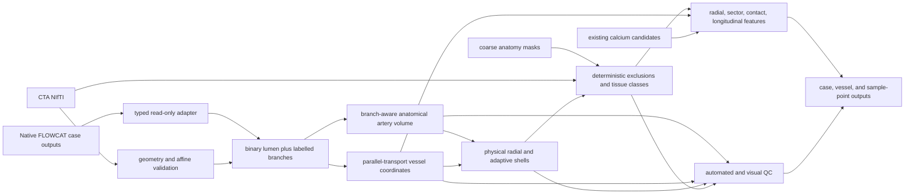

# Perivascular architecture

## Objective and milestone boundary

The scientific product is CTA-derived perivascular microenvironment phenotyping. The lumen, centreline, branch topology, and anatomical label define the coordinate frame; conventional stenosis and diameter are secondary geometry outputs. Milestone 1 is bilateral CCA, an explicitly derived carotid-bulb window, and proximal cervical ICA. Vertebral and subclavian specialist models remain deferred.

The architecture extends the maintained repository. It reuses `cta_common` physical geometry/I/O, the aorta package's calcium/fat feature conventions, the staged runner/QC patterns, the anterior-circulation adaptive law and bone-aware calcium logic, and FLOWCAT's native arterial products. It does not introduce another arterial segmentation model.

## Package layout and authority

### Existing shared infrastructure retained

- `cta_common/src/cta_common/io.py`: geometry-preserving image/mask loading and alignment checks.
- `cta_common/src/cta_common/shells.py`: existing physical-distance fixed shell implementation retained for the aorta pipeline and as a comparator.
- `aorta_cta_radiomics/src/aorta_cta_radiomics/calcification.py` and `calcium_omics.py`: existing high-attenuation candidate and burden conventions.
- `aorta_cta_radiomics/src/aorta_cta_radiomics/fat_omics.py`: existing fat HU/radial summary conventions.
- `aorta_cta_radiomics/src/aorta_cta_radiomics/qc_slicer.py` and `scripts/qc_slicer.py`: Slicer loading, triage, and review-log patterns.
- `subprojects/studies/anterior_circulation_supraaortic/scripts/adaptive_burden_core.py`: existing robust local diameter reference and capped adaptive law comparator.
- `subprojects/studies/anterior_circulation_supraaortic/scripts/bone_aware_calcium.py`: existing retained/definite-bone/ambiguous component partition.

### New typed FLOWCAT boundary

`aorta_cta_radiomics.flowcat_adapter` is read-only and does not import or modify FLOWCAT source. It discovers a standard case directory; hashes outputs; loads binary NIfTI; declares coordinates and units; parses centreline segments; validates NetworkX graph schemas; maps graph `cell_id` labels to centreline branches; loads landmarks and optional VTK surfaces; and records repository/model/dependency provenance.

Object NumPy arrays and pickle are code-execution risks. Their loaders default to refusal and require explicit `trusted_source=True` for files produced by the trusted local pinned pipeline. Trust opt-in is followed by schema validation; it is not a substitute for anatomical QC.

The authoritative external source is FLOWCAT Arterial branch `models/2026-03`, commit `1991ca5b238d7c868c9c3a0a390057bc89aee559`. The project's standalone checkout remains ignored and clean. The adapter records, but does not erase, the upstream coordinate caveat: the centreline array subtracts an LPI-corner translation and only handles a limited orientation set explicitly. Conversion to CTA RAS is tested and then checked by centreline-inside-lumen coverage.

### Anatomical artery-volume generator

`aorta_cta_radiomics.artery_volume` consumes already labelled physical centreline branches. It never predicts anatomy.

Strategy A, `nearest_centerline_labels`, assigns each compatible lumen voxel to the nearest labelled branch, constrained by seeded connected component, local radius, tie margin, and graph confidence. Its strengths are speed and a direct confidence margin; its failure modes are touching/parallel branches and bifurcations.

Strategy B, `branch_aware_connected_labels`, uses labelled branch markers and marker-controlled watershed on negative interior physical EDT within the lumen mask. It cannot cross a background disconnection and better respects branch topology. Its costs are memory/runtime and sensitivity to merged lumen bridges/marker placement.

`generate_anatomical_artery_volume` compares both strategies. Bifurcation zones, strategy disagreement, unseeded components, radius incompatibility, and low confidence become label `14`. It exports final labels, both strategy maps, confidence, uncertainty, bifurcation exclusion, and label summary. This is a derived rasterization of FLOWCAT graph labels, not a second labelling model.

### Vessel-centred coordinate system

`aorta_cta_radiomics.perivascular.coordinates` removes duplicate samples, resamples each physical polyline at a configured interval, computes cumulative path length and stable finite-difference tangents, and parallel-transports a normal/binormal frame. The initial normal is projected from a declared anatomical reference where stable; thereafter the rotation-minimizing frame avoids independent-plane flips.

The coordinate object supports physical-to-vessel and vessel-to-physical transforms. Each transformed point retains nearest centreline sample, axial offset, signed normal/binormal coordinates, radius and angle. Round-trip error is tested numerically. Curvature and torsion are computed in physical units and are null where numerically unstable.

Frames are independent per anatomical branch. Smoothing never crosses a bifurcation. A bulb region is an operational path interval around the CCA-to-ICA/ECA junction; the junction exclusion itself remains non-assessable for fine sector measurements.

### Shell engine and the adaptive maximum

`aorta_cta_radiomics.perivascular.shells` implements external physical Euclidean bands. Default bands are 0–1, 1–2, 2–3, 3–5, and 5–10 mm; compatibility bands are 0–2 and 2–5 mm. For every band it preserves raw and filtered masks, lumen exclusion, other-artery/bifurcation exclusions, valid denominators, exclusion fractions, spacing, and boundary-truncation state.

The general adaptive equation is

\[
t_j(s)=\operatorname{clip}\left(\alpha_jD_{\mathrm{ref}}(s),t_{\min,j},t_{\max,j}\right).
\]

`D_ref` is twice a branch-local smoothed contrast-lumen MIS radius; it is not outer-wall diameter. The initial fat envelope uses `alpha=1`, a resolution floor of approximately two maximum native voxels, and a 5-mm maximum. The initial calcium search extent uses a separate smaller coefficient and 2-mm maximum. Fat and calcium never share one extent merely for convenience. Raw and smoothed radius profiles and the maximum-hit/resolution-floor fractions are QC outputs.

### Anatomical exclusions and composition

`aorta_cta_radiomics.perivascular.exclusions` validates shapes, performs physical dilations, rasterizes bifurcation exclusions, and resolves overlapping masks by explicit first-priority-wins semantics.

`aorta_cta_radiomics.perivascular.composition` partitions the valid envelope into target artery, other artery, vein, bone, airway, thyroid/gland, skeletal muscle, fat, other non-fat soft tissue, high-density contamination, and uncertain/non-assessable tissue. Thresholds and overlap priority are configuration, not constants hidden in code. Primary/narrow/wide fat windows support sensitivity analysis. Non-finite CTA is non-assessable. Missing anatomical masks remain missing and lower confidence; they are not interpreted as absence of the structure.

Coarse TotalSegmentator or other model outputs are regional priors/exclusions. They are never assumed precise at the artery-tissue interface. The model registry in `config/anatomical_models.yaml` records source, version, licence, role, hardware, and validation state.

### Sectors, profiles, and contacts

`aorta_cta_radiomics.perivascular.sectors` maps shell voxels to the nearest stable centreline frame, computes `atan2` angle, assigns 8/16/32 sectors, and reports whether orientation is absolute RAS-derived or relative. Each sector retains radial band, valid volume, tissue fractions, attenuation summaries, uncertainty, and voxel count.

`aorta_cta_radiomics.perivascular.radial_profiles` aggregates by explicit band and by physical longitudinal bins. It computes weighted gradients and contiguous threshold runs without discarding the underlying sample-point curve.

`aorta_cta_radiomics.perivascular.contact` estimates target-lumen surface elements and assigns adjacent tissue at configured 0.5, 1.0, and 2.0-mm distances. It reports contact area, fraction, regions, longitudinal/circumferential profiles where coordinates are available, confidence, and QC. Contact fraction and shell volume fraction are distinct features.

### Quality control

`aorta_cta_radiomics.perivascular.qc` currently produces stable flags for
non-orthonormal vessel frames; shell truncation, adjacent-artery exclusion,
radial-band overlap, and empty valid shells; excessive vein, bone, or uncertain
fractions; insufficient fat voxels; and boundary-truncated or ambiguous surface
contacts. The FLOWCAT adapter separately rejects missing/invalid required files,
unsafe object/pickle loading, non-binary or geometrically incompatible NIfTI,
invalid graph/label/radius schemas, orphan `cell_id` mappings, out-of-image
centreline points, and unavailable optional VTK support. Centreline-inside-lumen
coverage, calcium-blooming severity, artifact detection, and full anatomical
plausibility flags remain validation/backlog items; their absence must not be
interpreted as a pass.

Visual QC combines axial/coronal/sagittal context, artery labels, centrelines, shells, tissue classes, calcium, contact, sector plots, longitudinal curves, output completeness, and provenance. Montages are triage; named-vessel continuity/laterality and difficult intervals require 3D Slicer review.

## Scientific compartment model

The arterial compartment is the contrast-lumen mask, surface, centreline, topology, anatomical identity, local MIS radius, and branch coordinates. Visible disease is calcium/high attenuation, visible plaque/protrusion, thrombus/narrowing where a validated module exists, and explicitly uncertain wall/plaque interfaces. Routine CTA does not provide a universal histological wall label.

The perivascular compartment partitions adipose, muscle, vein, bone, thyroid/gland, airway, residual non-fat soft tissue, high-density contamination, uncertain tissue, and non-assessable tissue. The residual can contain connective tissue, fascia, small vessels/nerves/lymphatics, unsegmented muscle, plaque, partial volume, and artifact; uncertainty is therefore preserved rather than biologically overnamed.

## Resolution and interpolation policy

Native CTA is the information limit. A crop may be resampled near 0.4–0.6-mm isotropic for carotid computation only when supported by native resolution. Upsampling does not create detail. Every output records native/resampled spacing, matrices, interpolation, physical field of view, and support assessment. CTA uses continuous interpolation; categorical masks use nearest neighbour. Physical measurements and final masks map back to original space/affine.

## Three-level outputs

- Case: `case_summary.json` with image geometry, model/software versions, FLOWCAT source, config hash, runtime/hardware, failures, missing products, and global QC.
- Vessel: `vessel_level_features.csv` with coverage, explicit radius/diameter method, geometry, calcium, composition, contact, gradients, uncertainty, and manual-review state.
- Sample point: Parquet when an engine is installed, otherwise a manifest-declared CSV fallback, preserving physical point/frame, local geometry, radial/sector/contact/calcium measurements, and QC.
- Volumes: NIfTI for artery strategies/final labels, confidence/uncertainty, bifurcation zones, raw/filtered shells, tissue classes, calcium ambiguity, and contact overlays.
- Geometry: VTK/VTP for surfaces/centrelines when available.

`aorta_cta_radiomics.output_schema` implements the typed case/vessel/sample records, configuration hash, file SHA-256, and explicit output manifest.

## Failure behavior and current blocker

Required products are never silently skipped. A missing binary segmentation fails before geometry. A missing native centreline/branch/anatomical graph writes a manifest and `blocked_missing_native_flowcat_outputs`; it must not fall back silently to a skeleton and continue as named anatomy. Missing optional muscle/vein/thyroid context may continue only with explicit uncertainty/non-assessable compartments and a manual-review flag.

The five local fast-lowres FLOWCAT cases currently have binary segmentation only. No native `branch_model.vtk`, `centerline_segments_array.npy`, `segments_graph_pred.pickle`, or `local_graph.pickle` exists. The technical skeleton/EDT files are development fallbacks without anatomical labels. Therefore the real-case named CCA/bulb/ICA milestone remains blocked until one full FLOWCAT chain is run in a compatible Linux VMTK/PyG environment and reviewed.

## Compatibility and migration

The existing aorta CLI and shell imports are unchanged. New modules are additive and typed. Existing fixed whole-tree outputs remain historical comparators and are not overwritten. FLOWCAT source remains external and unmodified. The local segmentation wrapper should eventually call the upstream high-level `VesselSegmenter` rather than duplicate orchestration, after an equivalence test. The new adapter, label propagation, coordinate, shell, composition, and output schema have synthetic tests and can be reviewed independently.
